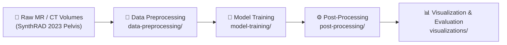

# Deep Learning-Based Anomaly Detection for MR-Only Radiotherapy

This repository contains the full pipeline for detecting metallic implant anomalies in pelvic MR images using unsupervised deep learning. The work is based on the **SynthRAD 2023 Pelvis** dataset and evaluates ten anomaly detection model families in a one-class classification setting, where only normal (implant-free) scans are used for training.

---

## Pipeline Overview



| Stage | Module | Description |
| :--- | :--- | :--- |
| **1 — Preprocessing** | [`data-preprocessing/`](data-preprocessing/README.md) | Converts 3D MR/CT NIfTI volumes into normalised 2D slices (PNG or NIfTI). Generates binary anomaly labels via CT Hounsfield-Unit thresholding refined by the MR signal, and exports body masks for downstream filtering. |
| **2 — Training** | [`model-training/`](model-training/README.md) | Unified training and feature-extraction pipeline for ten anomaly detection model families: Normalizing Flow (FastFlow, CFlow), Knowledge Distillation (RD4AD, STFPM), Memory Bank (PatchCore, CFA), One-Class (DeepSVDD, CutPaste), and Reconstruction (DRAEM, Dinomaly). |
| **3 — Post-Processing** | [`post-processing/`](post-processing/README.md) | Refines raw binary prediction masks through body masking, morphological closing, and a 3D volumetric persistence filter. Computes pixel-, slice-, and patient-level evaluation metrics. |
| **4 — Visualization** | [`visualizations/`](visualizations/README.md) | Jupyter notebooks and scripts for dataset statistics, NIfTI channel diagnostics, mask refinement analysis, and standardised side-by-side model prediction comparisons. |

---

## Repository Structure

```
MR-OOD-Anomaly-Detection/
│
├── data-preprocessing/          # Stage 1: MR/CT volume → 2D slice dataset
│   ├── README.md
│   ├── labels/                  # CT HU stats, patient split assignments, OOD label files
│   └── scripts/src/             # Processing driver scripts + utility modules
│
├── model-training/              # Stage 2: Train and extract anomaly maps
│   ├── README.md
│   ├── SETUP.md
│   ├── train.py                 # Unified training entry point
│   ├── extract.py               # Unified anomaly map + mask extraction
│   ├── config/                  # Per-model YAML configurations
│   ├── models/                  # Model registry (flow, kd, memory, recon)
│   ├── data/                    # NIfTI → PNG dataset conversion
│   ├── scripts/                 # setup / train / extract / run_pipeline shell scripts
│   ├── Deep-SVDD/               # BMAD Deep-SVDD implementation
│   └── pytorch-cutpaste/        # BMAD CutPaste implementation
│
├── post-processing/             # Stage 3: Refine masks + evaluate
│   ├── README.md
│   ├── main_pipeline.py         # End-to-end pipeline entry point
│   ├── apply_bodymask.py        # Stage 1: body mask application
│   ├── filter_prediction_masks_consecutive.py  # Stage 4: 3D persistence filter
│   ├── evaluate_model_outputs.py               # Pixel / slice / patient metrics
│   ├── compute_pixel_metrics.py
│   ├── postprocess_utils.py
│   ├── morphology/              # Morphological processing + NIfTI reconstruction
│   ├── visualization/           # Pipeline-specific figure scripts
│   ├── config/                  # Morphology tuning configuration
│   └── results/                 # Pipeline overview diagrams
│
├── visualizations/              # Stage 4: Reporting & analysis notebooks
│   ├── README.md
│   ├── visualize.py             # CLI tool: 3-panel MR / GT / prediction plots
│   ├── channel_test.ipynb       # NIfTI channel format diagnostics
│   ├── dataset_stats.ipynb      # Patient / slice distribution charts
│   ├── mask_refinement.ipynb    # Mask refinement procedure visualizations
│   ├── discussion_visualization.ipynb  # Multi-model GT vs. prediction analysis
│   └── figures/                 # Output figures
│
└── README.md                    # This file
```

---

## Quick Start

### 1. Preprocess the raw dataset

```bash
# Single-center, PNG output (bone colormap)
python data-preprocessing/scripts/src/sc_dataset_processing_png.py \
  --dir_pelvis /path/to/Task1/pelvis \
  --dir_output /path/to/dataset
```

See [`data-preprocessing/README.md`](data-preprocessing/README.md) for all output formats (PNG, NIfTI replicated, NIfTI consecutive) and multi-center variants.

### 2. Set up the training environment

```bash
bash model-training/scripts/setup.sh
```

See [`model-training/SETUP.md`](model-training/SETUP.md) for manual installation steps and dataset variant configuration.

### 3. Train a model and extract anomaly maps

```bash
# Full pipeline: setup → train → extract (example: FastFlow)
bash model-training/scripts/run_pipeline.sh fastflow /path/to/dataset exp1 0

# Or step by step:
python model-training/train.py --config model-training/config/fastflow.yaml \
  --data_root /path/to/dataset --name exp1_fastflow

python model-training/extract.py --config model-training/config/fastflow.yaml \
  --checkpoint model-training/results/fastflow/exp1_fastflow/checkpoints/last.ckpt \
  --output_dir /path/to/extract_out
```

### 4. Post-process and evaluate

```bash
python post-processing/main_pipeline.py \
  --input-dir /path/to/extract_out/prediction_masks/test \
  --body-mask-dir /path/to/dataset \
  --output-root post_process_outputs \
  --ground-truth-dir /path/to/dataset/test
```

Metrics are written to `post_process_outputs/metrics/metrics_summary.json`. See [`post-processing/README.md`](post-processing/README.md) for morphology tuning and 3D volume inspection.

### 5. Visualize results

```bash
# Side-by-side MR / ground truth / prediction comparison
python visualizations/visualize.py \
  --mr_path /path/to/mr.nii.gz \
  --predicted_mask_path /path/to/pred.nii.gz \
  --ground_truth_path /path/to/gt.nii.gz \
  --output_directory ./figures \
  --model_name "FastFlow"
```

See [`visualizations/README.md`](visualizations/README.md) for the full notebook suite.

---

## Supported Models

| Model | Family |
| :--- | :--- |
| FastFlow | Normalizing Flow |
| CFlow | Normalizing Flow |
| RD4AD | Knowledge Distillation |
| STFPM | Knowledge Distillation |
| PatchCore | Memory Bank |
| CFA | Memory Bank |
| DeepSVDD | One-Class |
| CutPaste | One-Class |
| DRAEM | Reconstruction |
| Dinomaly | Reconstruction |

---

## Dataset

The pipeline is built around the **SynthRAD 2023 Pelvis** dataset. The preprocessing step produces three dataset variants:

| Variant | Format | Description |
| :--- | :--- | :--- |
| `synth23_pelvis_v7_png` | PNG | Single-slice, bone colormap, 3-channel |
| `synth23_pelvis_v7_nifti_3ch_rep` | NIfTI | Single-slice replicated across 3 channels |
| `synth23_pelvis_v7_nifti_con` | NIfTI | Three consecutive slices (prev / current / next) |

All variants share the same folder layout expected by `model-training/`:

```
<dataset_root>/
├── train/good/
├── valid/good/img/
├── valid/Ungood/img/
├── valid/Ungood/label/
├── test/good/img/
├── test/good/bodymask/
├── test/Ungood/img/
├── test/Ungood/bodymask/
└── test/Ungood/label/
```

---

## Dependencies

Each module ships its own requirements file:

```bash
# Training environment
pip install -r model-training/requirements-all.txt \
  --extra-index-url https://download.pytorch.org/whl/cu124

# Post-processing environment
pip install -r post-processing/requirements.txt
```

Key packages: `anomalib==2.2.0`, `torch==2.6.0`, `nibabel==5.3.2`, `opencv-python==4.8.1.78`, `scipy==1.10.1`, `scikit-learn`.
