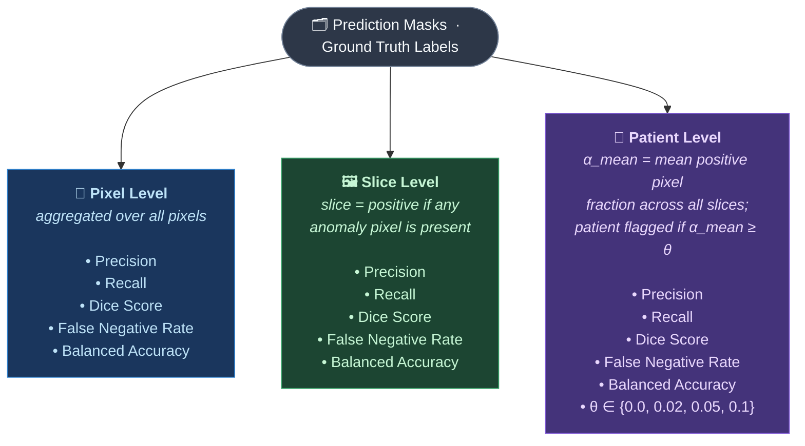

# Post-Processing Pipeline — MR-OOD Anomaly Detection

Post-processing and evaluation for binary anomaly prediction masks produced by the detection models (FastFlow, CFlow). Takes raw prediction masks and body masks as input, applies body masking, morphological filtering, and a 3D persistence filter, then computes pixel-, slice-, and patient-level metrics.


The pipeline refines raw model predictions in four stages:

1. **Body-mask** — The raw prediction mask is multiplied element-wise by an anatomical body mask derived from the MR volume. This removes spurious detections outside the patient body (e.g. table, air).
2. **Slice-wise Operations** — Per-slice morphological processing: small isolated components below a minimum pixel area are discarded, then morphological closing fills gaps and smooths region boundaries.
3. **Volumetric Consistency** — Any 2D anomaly region that does not overlap with a detection in at least one neighbouring slice is removed. This enforces that true anomalies are spatially coherent across the volume.
4. **Volume Reconstruction** — The final 2D masks are stacked into 3D NIfTI volumes for both the raw and post-processed predictions, enabling downstream volumetric inspection and comparison.

---

## Evaluation

Evaluation runs automatically on both the raw and post-processed masks and is saved to `metrics/metrics_summary.json`. Metrics are assessed at three levels of granularity — from individual pixels up to whole patients — to give a complete picture of model performance across spatial scales:



---

## Input Structure

Raw prediction masks from the model extraction step:

```
<extraction_output_root>/
  anomaly_maps/test/{good,Ungood}/img/     ← per-slice .npy anomaly scores
  prediction_masks/test/{good,Ungood}/img/ ← binary PNG masks (0 or 255)
```

Body masks and ground-truth labels from the preprocessing step:

```
<dataset_root>/test/
  good/img/        ← source MR slices (PNG)
  good/bodymask/   ← binary body masks (PNG)
  Ungood/img/
  Ungood/bodymask/
  Ungood/label/    ← ground-truth anomaly masks (PNG)
```

---

## Output Structure

```
<output_root>/
  01_body_masked_png/           ← after body-mask application
  02_morphology_png/            ← after small-component filter + morphological closing
  03_consecutive_filtered_png/  ← final masks (3D persistence filter)
  volumes/
    raw/                        ← 3D NIfTI from raw prediction masks
    post_processed/             ← 3D NIfTI from post-processed masks
    ground_truth/               ← 3D NIfTI from ground-truth masks
  metrics/
    metrics_summary.json        ← pixel/slice/patient metrics (raw + post-processed)
```

---

## Post-Processing Stages

The pipeline applies the following stages sequentially to the raw binary prediction masks:

1. **Body masking** (`apply_bodymask.py`): Multiply each prediction mask element-wise by the anatomical body mask to remove out-of-body detections. The body mask subdirectory (`bodymask/`) is resolved automatically from the dataset root.
2. **Small-component filtering** (`morphology/processor.py`): Binarize (threshold=0.5) and remove connected components smaller than **τ_area = 3 pixels**.
3. **Morphological closing** (`morphology/processor.py`): Dilation × N followed by erosion × N. Fills small intra-region gaps and smooths contours.
4. **3D persistence filter** (`filter_prediction_masks_consecutive.py`): Discard any 2D connected component that does not overlap with an anomaly region in at least one neighbouring slice.
5. **NIfTI reconstruction** (`morphology/stack_to_3d.py`): Stack 2D PNG slices into patient-wise 3D NIfTI volumes for both the raw and post-processed masks.

Default morphology parameters (configurable via CLI or `config/morpho_val.yaml`):

```
--min-component-size 3      # τ_area: minimum CC size in pixels
--kernel-size 5             # structuring element size (must be odd)
--kernel-shape ellipse      # or rect
--dilate-iterations 1       # dilation passes per round
--erode-iterations 1        # erosion passes per round
--num-rounds 1              # number of (dilate+erode) rounds
```

### Morphological Settings Evaluated

Three variants were evaluated on the validation set to select the best trade-off between recall and precision. The **aggressive** setting was selected for the report, favouring reconnection of fragmented artifact regions and reducing the risk of missed detections.

| Experiment | Dilate | Erode | Rounds | Strategy | Area Preserved | CCs Removed | Used |
| :--- | :---: | :---: | :---: | :--- | :---: | :---: | :---: |
| baseline | 1 | 1 | 1 | Balanced — moderate gap-filling, preserves most structure | 84.65 % | 15 | |
| **aggressive** | 2 | 1 | 1 | Maximise recall — reconnects fragmented regions, grows detections | 311.29 % | 0 | ✓ |
| conservative | 1 | 2 | 1 | Maximise precision — suppresses small false positives | 24.57 % | 5 | |

> **Area Preserved** is the ratio of total post-processed anomaly area to raw prediction area on the validation set (97 slices). Values above 100 % indicate net growth from dilation; values below indicate net suppression from erosion or component removal. **CCs Removed** counts 2D connected components discarded by the minimum-size filter. For the aggressive configuration, CCs Removed = 0 because the net-growing closing (nd = 2 > ne = 1) never shrinks regions below the area threshold; the subsequent 3D persistence filter likewise removed no additional components.

---

## Evaluation

`evaluate_model_outputs.py` computes metrics at three granularities:

- **Pixel level**: precision, recall, Dice score, false negative rate, balanced accuracy (aggregated over all prediction–ground-truth pixel pairs).
- **Slice level**: each 2D slice classified as positive/negative; standard binary classification metrics.
- **Patient level**: mean positive fraction (α_mean) per patient. Patients classified as anomalous if α_mean ≥ threshold; metrics reported for multiple thresholds (default: 0.0, 0.02, 0.05, 0.1).

`main_pipeline.py` evaluates both the raw input masks and the stage-2 output (`02_morphology_png`) and writes both to `metrics/metrics_summary.json`. Stage 3 (`03_consecutive_filtered_png`) is the final mask used for 3D NIfTI export and qualitative inspection; evaluation is on stage 2.

### Standalone Metrics

```bash
python evaluate_model_outputs.py \
  --prediction-dir post_process_outputs/02_morphology_png \
  --ground-truth-dir /path/to/dataset/test \
  --mean-fraction-thresholds 0.0 0.02 0.05 0.1 \
  --output-json metrics.json
```

---

## Quick Start

### Full Pipeline

```bash
python main_pipeline.py \
  --input-dir /path/to/prediction_masks/test \
  --body-mask-dir /path/to/dataset/root \
  --output-root post_process_outputs \
  --ground-truth-dir /path/to/dataset/root/test \
  --skip-missing-body-mask
```

The body mask subdirectory (`bodymask/`) and the ground-truth label subdirectory (`label/`) are resolved automatically. The `--ground-truth-dir` argument is optional; omitting it skips metric computation and ground-truth volume export.

### Morphology Parameter Tuning

Edit `config/morpho_val.yaml` with your validation mask paths and parameter combinations, then run:

```bash
python morphology/tune_morpho.py
```

Results are saved to `reports/morphology_tuning/tuning_report.json`.

---

## Visualization

Scripts in `visualization/` can be run directly from that folder (they add the repo root to the Python path automatically).

| Script | Output |
| :--- | :--- |
| **`visualize_processed_anomaly_maps.py`** | Side-by-side comparison of original vs. body-masked anomaly maps |
| **`visualize_processed_prediction_masks.py`** | Raw, body-masked, and filtered prediction mask panels |
| **`visualize_anomaly_thresholded_outputs.py`** | Anomaly map next to its thresholded binary output |
| **`convert_to_bone_colormap.py`** | Convert NIfTI slices to bone-colormap PNGs for inspection |

Example:

```bash
python visualization/visualize_processed_prediction_masks.py \
  --raw-dir /path/to/prediction_masks/test \
  --masked-dir post_process_outputs/01_body_masked_png \
  --image-dir /path/to/dataset \
  --image-replace prediction_masks:test \
  --output-dir prediction_mask_comparisons
```

---

## Repository Structure

```
Post-Processing-Pipeline/
│
├── main_pipeline.py                        # End-to-end pipeline entrypoint
├── apply_bodymask.py                       # Stage 1: body mask application
├── postprocess_utils.py                    # Shared I/O and array utilities
├── filter_prediction_masks_consecutive.py  # Stage 4: 3D persistence filter
├── evaluate_model_outputs.py               # Pixel/slice/patient metrics
├── compute_pixel_metrics.py                # Per-slice metric primitives
│
├── morphology/                             # Morphological processing + NIfTI reconstruction
│   ├── processor.py                        # MorphologyProcessor, BatchProcessor
│   ├── stack_to_3d.py                      # BatchNIfTIStacker (2D PNG → 3D NIfTI)
│   ├── slice_metrics.py                    # Metric helpers
│   ├── pipeline_tuning.py                  # Tuning pipeline logic
│   ├── tune_morpho.py                      # Tuning entrypoint
│   └── README.md                           # Detailed morphology documentation
│
├── visualization/                          # Report and presentation figures
│   ├── visualize_processed_anomaly_maps.py
│   ├── visualize_processed_prediction_masks.py
│   ├── visualize_anomaly_thresholded_outputs.py
│   └── convert_to_bone_colormap.py
│
├── config/
│   └── morpho_val.yaml                     # Morphology tuning configuration
│
├── results/                                # Report figures
│   └── image.png                           # Pipeline overview diagram
│
├── old_code/
│   └── apply_morpho.py                     # Legacy standalone batch apply (superseded by main_pipeline.py)
│
├── requirements.txt
└── README.md
```

---

## Dependencies

```bash
pip install -r requirements.txt
```

Key packages: `anomalib==2.2.0`, `torch==2.8.0`, `nibabel==5.3.2`, `opencv-python==4.8.1.78`, `scipy==1.10.1`, `scikit-learn`.
