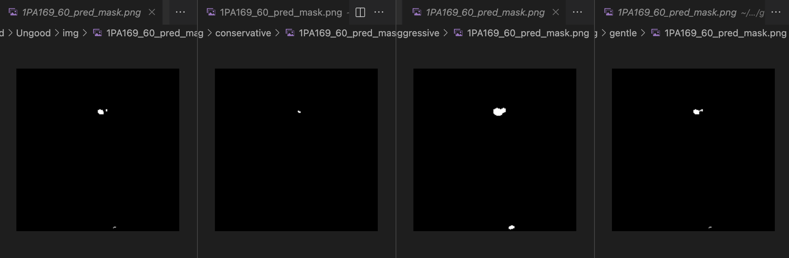
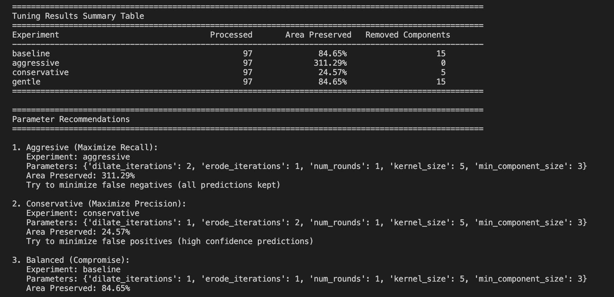

# Morphological Operations

Post-processing pipeline for anomaly detection prediction masks with morphological operations and 3D volume generation.

---

## Updata 20.10.2025
- Added ./apply_bodymask_pred.py to apply bodymask only on pred_masks

```bash
python apply_bodymask_fastflow.py \
  --body-mask-dir /local/scratch/cweijie/ood23 \
  --prediction-mask-dir ab_mask
```

- Added stack_to_3d.py to generate 3d volumes (nii.gz), for details see below

## Quick Start

### Step 1. Tune parameters (val set)
#### Update Configuration for Tuning i.e. Validation/Ungood

Edit `config/morpho_validation.yaml` and set your data path:

```yaml
paths:
  output_base: "/path/to/your/applied/bodymask/prediction_masks/valid/Ungood" 
```

This should point to your binary prediction masks directory (PNG format, after body mask has been applied).
Report will be stored in ./reports/morphology_tuning/tuning_report.json

#### Run Tuning Pipeline

```bash
python morphology/tune_morpho.py
```

The script will:
- Verify input data exists and is in correct format
- Process masks through all parameter combinations defined in config
- Generate comparison reports and recommendations

### Step 2 Apply to Entire Model Directory (test set)
```bash
python morphology/apply_morpho.py \
  --model fastflow \
  --experiment aggressive \
  --config config/morpho_val.yaml
```

Input Structure:
```tree
./masks_ab/fastflow/
├── valid/Ungood/*.png
├── valid/Good/*.png
├── test/Ungood/*.png
└── test/Good/*.png
```

Output:
```tree
./masks_morpho/fastflow_aggressive/
├── valid/Ungood/*.png
├── valid/Good/*.png
├── test/Ungood/*.png
└── test/Good/*.png
```

### 3. Convert to 3D nifti volumes

Stack processed 2D PNG slices into patient-wise 3D volumes:

```bash
python morphology/batch_stack_to_3d.py \
  --model fastflow \
  --experiment aggressive \

```
*Voxel spacing can be adjusted, default 1.0, 1.0, 1.0

This creates patient-wise 3D volumes, groups slices by patient ID (e.g., `PA133.nii.gz`, `PA134.nii.gz`) that can be inspected in:
- **NiiVue** (VS Code extension) - Quick preview. !!**Attention**!!: Matrix size keeps (224 x 224 x number of slicec), but shows another size with its rendering scale, and in another direction from the original one.
- **3D Slicer** - Detailed analysis and comparison

---

## Flow

Before Postprocessing **Training Output Format:**
- Anomalib models output prediction masks as **PNG by default**, regardless of input format
- This applies to all of our input types:
  - 2D PNG slices
  - 2D NIfTI slices  (repeated 3 channels)
  - 2.5D NIfTI volumes (consecutive 3 channels)


### Postprocessing Pipeline Overview
```
Input PNG Masks (2D)
    ↓ 
[Step 0] Extraction and application of bodymasks
    ↓ 
[Step 1] Binarization (threshold = 0.5), Filter Small Components (min_size = 3 pixels) ← EARLY NOISE REMOVAL
    ↓
[Step 2] Morphological Operations (2x Dilation → Erosion (aggresive), suggested from Mariia in the Meetup 16.10.2025)
    ↓
Output PNG Masks (2D)
    ↓
[Step 3] Stack to 3D NIfTI 
    ↓
[Step 4] Consecutive slices filtering
```

**Note**: Step 4 is not yet implemented in this version.


## Details
### Configuration of Closing (morpho ops)

`config/morpho_validation.yaml` contains tuning experiments with different parameter combinations:

```yaml
tuning_experiments:
  - name: "baseline"
    dilate_iterations: 1
    erode_iterations: 1
    num_rounds: 1
    kernel_size: 5
    min_component_size: 3
    
  - name: "aggressive"
    dilate_iterations: 2
    erode_iterations: 1
    num_rounds: 1
    kernel_size: 5
    min_component_size: 3
    
  - name: "conservative"
    dilate_iterations: 1
    erode_iterations: 2
    num_rounds: 1
    kernel_size: 5
    min_component_size: 3
    # ... more combinations
```

To add new combinations, simply add another entry with different parameters.

---

### Core Processing

Core processing in `morphology/processor.py`:

#### Early Component Filtering

1. **Filter Small Components FIRST** (min_component_size = 3 pixels)
   - Removes noise and artifacts early
   - Prevents small noise from being expanded by morphology
2. **Then Apply Morphological Operations** (Dilation → Erosion)
   - Dilation: Expands remaining anomaly regions, connects nearby fragments
   - Erosion: Restores approximate original size while maintaining connectivity
   - Repeated `num_rounds` times


#### Morphological Closing Operation

Each round performs:
1. **Dilation × `dilate_iterations`**: Expand anomalies, fill small gaps
2. **Erosion × `erode_iterations`**: Shrink back while preserving connectivity

The kernel shape (default: ellipse) affects how regions expand/contract.

---

## Output

### Tuning Results
Results are saved to:
- **Statistics report**: `./reports/morphology_tuning/tuning_report.json`
  - Per-slice statistics
  - Average metrics across all slices
  - Component filtering statistics

### 3D Volumes 
When using `stack_to_3d.py`:
- **Patient volumes**: `./nifti_volumes/{experiment_name}/PA{patient_id}.nii.gz`
- One NIfTI file per patient, containing all their slices stacked along z-axis

---

## Understanding Results

### Tuning Metrics

**Area Preserved Ratio**: Percentage of original mask area retained after processing
- Higher (e.g., 85%) = More aggressive, preserves more detections
- Lower (e.g., 60%) = More conservative, removes uncertain regions

**Components Removed (Early)**: Number of small connected components filtered out before morphology
- Higher = Stricter noise removal
- Depends on `min_component_size` parameter

### Parameter Effects

**Aggressive parameters** (higher `dilate_iterations`):
- Preserve more area (higher % retained)
- Detect more anomalies (minimize false negatives)
- May include uncertain/borderline detections
- Good for: High recall, capturing all possible anomalies

**Conservative parameters** (higher `erode_iterations`):
- Preserve less area (lower % retained)
- Keep only high-confidence detections (minimize false positives)
- Remove edge regions and small uncertain areas
- Good for: High precision, confident predictions only

**Larger kernel** (e.g., `kernel_size: 7` vs `5`):
- Stronger smoothing effect
- Connects components farther apart
- May over-smooth small details

---

## 3D Volume Inspection

### Generating Volumes

After selecting optimal parameters from tuning (e.g., "aggressive"):

```bash
python morphology/stack_to_nifti.py \
  --input-dir ./output/validation_morpho_tuning/aggressive \
  --output-dir ./nifti_volumes/aggressive \
```

### Inspection Methods

#### Option 1: NiiVue (Quick Preview)

For quick checks:

1. Install NiiVue browser extension or use web version
2. Load your `.nii.gz` file
3. View in **axial** planes

#### Option 2: 3D Slicer 


## Current Status

**Stage**: Parameter optimization on validation set pred masks from **FastFlow** model




### Completed
- ✓ Tuning pipeline with multiple parameter combinations
- ✓ Early component filtering (before morphology)
- ✓ Patient-wise 3D volume generation
- ✓ Detailed statistics and recommendations
- ✓ Test optimized parameters on other models' validation data
- ✓ Generate 3d nifti volumes

### Next Steps
1. **Step 4**: Add consecutive slices filtering
   - Remove anomalies that don't appear in multiple consecutive slices
   - Reduces false positives from isolated artifacts
2. Apply final parameters to test set
3. Integration with volume-based evaluation metrics


## References

- Morphological operations: [OpenCV Morphological Transformations](https://docs.opencv.org/4.x/d9/d61/tutorial_py_morphological_ops.html)
- Connected components: [cv2.connectedComponentsWithStats](https://docs.opencv.org/4.x/d3/dc0/group__imgproc__shape.html#gae57b028a2b2ca327227c2399a9d53241)
- NiiVue: [https://github.com/niivue/niivue](https://github.com/niivue/niivue)