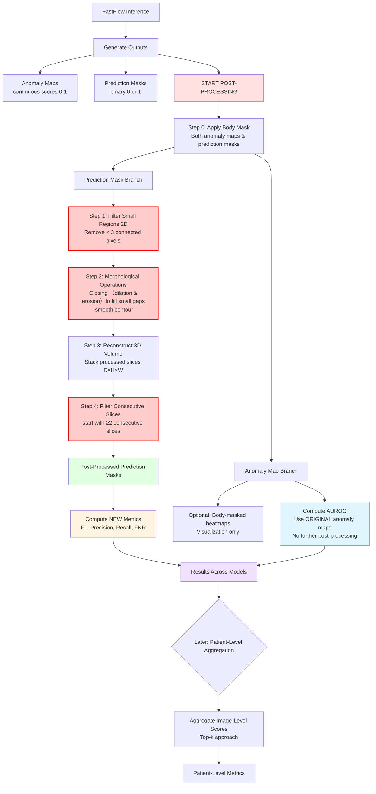

```mermaid
graph TD
    A[FastFlow Inference] --> B[Generate Outputs]
    B --> C[Anomaly Maps<br/>continuous scores 0-1]
    B --> D[Prediction Masks<br/>binary 0 or 1]

    %% unified postprocessing start
    B --> F[START POST-PROCESSING]

    F --> G[Step 0: Apply Body Mask<br/>Both anomaly maps & prediction masks]

    %% anomaly map branch
    G --> C0[Anomaly Map Branch]
    C0 --> E[Compute AUROC<br/>Use ORIGINAL anomaly maps<br/>No further post-processing]
    C0 --> CV[Optional: Body-masked heatmaps<br/>Visualization only]

    %% prediction mask branch
    G --> D0[Prediction Mask Branch]
    D0 --> J[Step 1: Filter Small Regions 2D<br/>Remove < 3 connected pixels]
    J --> K[Step 2: Morphological Operations<br/> Closing （dilation & erosion）to fill small gaps<br/> smooth contour]
    K --> M[Step 3: Reconstruct 3D Volume<br/>Stack processed slices D×H×W]
    M --> N[Step 4: Filter Consecutive Slices<br/>start with ≥2 consecutive slices]
    N --> O[Post-Processed Prediction Masks]
    O --> P[Compute NEW Metrics<br/>F1, Precision, Recall, FNR]

    P --> U[Results Across Models]
    E --> U

    U --> V{Later: Patient-Level Aggregation}
    V --> W[Aggregate Image-Level Scores<br/>Top-k approach]
    W --> X[Patient-Level Metrics]

    style E fill:#e1f5ff
    style F fill:#ffe1e1
    style O fill:#e1ffe1
    style P fill:#fff4e1
    style U fill:#f0e1ff

    classDef important fill:#ffcccc,stroke:#ff0000,stroke-width:2px
    class J,K,N important


```