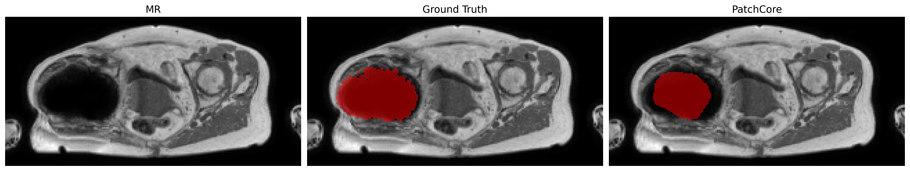

# MR-OOD: Visualization & Reporting Suite
This repository contains the tools and Jupyter Notebooks used to generate data statistics and produce visualizations for the MR Out-of-Distribution (OOD) anomaly detection project.

## Features
- **Data Diagnostics**: Verify NIfTI consistency across different channel formats (1-channel vs. 2.5D).
- **Statistical Reporting**: Generate patient and slice distribution analysis for dataset versioning.
- **Comparative Visualization**: Standardized reporting of raw MR, ground truth, and model predictions.

---

## File Overview

### Python Scripts
- **`visualize.py`**: A command-line tool designed to generate standardized 3-panel comparison plots.

### Jupyter Notebooks
- **`channel_test.ipynb`**: Diagnostic tool to verify NIfTI image consistency and distinguish between 2.5D and 1-channel data formats.
- **`dataset_stats.ipynb`**: Generates bar charts comparing patient and slice distributions across ID/OOD splits and dataset versions.
- **`mask_refinement.ipynb`**: Visualization of the mask refinement procedure and morphological operations.
- **`discussion_visualization.ipynb`**: Research notebook for testing Ground Truth masks against predictions from multiple anomaly detection models.

---

## Usage: Visualization Script

The `visualize.py` script generates side-by-side comparisons of the MR, the ground truth mask, and the predicted model mask. It produces a 1x3 grid for a specific slice (if provided) or for all slices in a patient volume containing masks.

### Command Example
```bash
python visualize.py \
  --mr_path /path_to_mr/1PA118/mr.nii.gz \
  --predicted_mask_path /path_to_prediciton/PA118.nii.gz \
  --ground_truth_path /path_to_ground_truth/PA118.nii.gz \
  --output_directory ./results_visualization \
  --model_name "PatchCore" \
  --saving_format png \
  --patient_slice 47
```
### Example Vizualization


---

## Usage: Post-Processing Visualization
In addition to the standard visualization pipeline, we provide tools to inspect intermediate and final outputs of the post-processing pipeline, including prediction masks, anomaly maps, and thresholded results.

The `volumes/` directory is automatically generated by the post-processing pipeline. If the default output structure has not been modified, the command examples below can be used directly without additional configuration.


**`visualize_processed_prediction_masks.py`**: This visualization compares:

- Raw prediction masks (before post-processing)
- Post-processed masks (after morphology + filtering)
- Optional overlays with body mask and ground truth

### Command Example
```bash
python visualize_processed_prediction_masks.py \
  --raw-dir volumes/raw/Ungood/img \
  --masked-dir volumes/post_processed/Ungood/img \
  --body-mask-dir volumes/ground_truth/Ungood/bodymask \
  --image-dir volumes/ground_truth/Ungood/img \
  --ground-truth-dir volumes/ground_truth/Ungood/label \
  --output-dir ./viz_prediction_masks \
  --include-all-labels \
  --skip-missing
```

### Example Vizualization


---

**`visualize_processed_anomaly_maps.py`**: This visualization compares:

- Original anomaly maps
- body-masked outputs
### Command Example
```bash
  python visualize_processed_anomaly_maps.py \
  --anomaly-dir volumes/raw/Ungood/img \
  --masked-dir volumes/post_processed/Ungood/img \
  --image-dir volumes/ground_truth/Ungood/img \
  --comparison-dir ./viz_anomaly_pairs \
  --skip-missing
```
### Example Vizualization


---

**`visualize_anomaly_thresholded_outputs.py`**: This visualization compares:
- Anomaly map (continuous values)
- Thresholded output (binary mask)
- Optional overlay on MR image
### Command Example
```bash
  python visualize_anomaly_thresholded_outputs.py \
  --anomaly-dir volumes/raw/Ungood/img \
  --thresholded-dir volumes/post_processed/Ungood/img \
  --image-dir volumes/ground_truth/Ungood/img \
  --comparison-dir ./viz_anomaly_thresholded \
  --skip-missing
```
### Example Vizualization

